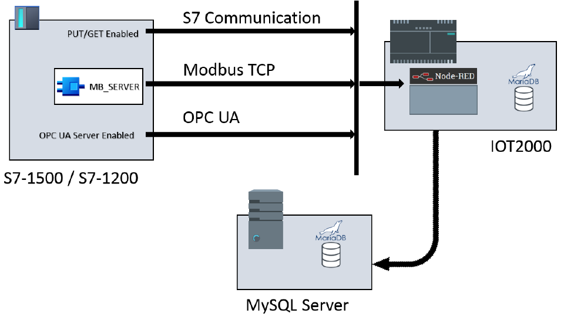

# **IOT-Data-Collector**

- [**IOT-Data-Collector**](#iot-data-collector)
  - [**Overview**](#overview)
    - [**Used Components**](#used-components)
    - [**Goal**](#goal)
    - [**Installation and configuration**](#installation-and-configuration)
  - [**Related Links**](#related-links)
  - [**Contribution**](#contribution)
  - [**Licence and Legal Information**](#licence-and-legal-information)

## **Overview**

This application example shows three different options that enable the IOT2050 user to read data from a S7-PLC using Node-RED. The data exchange between a S7-1500 or a S7-1200 and the IOT2050 is carried out using the following protocols:

- S7 Communication
- Modbus TCP
- OPC UA

In addition to collecting data, the example also shows, how this data can be stored in a SQL database. To avoid the loss of data in case the connection to the database is interrupted, 3600 values are stored in a ring buffer on the IOT and are immediately sent to the database whenever the connection is reestablished.

### **Used Components**

This Example was created using the following Software:

- **On Windows:**
  - TIA Portal V16 or V17
- **On Ubuntu:**
  - Firefox Quantum for Ubuntu canonical - 1.0
  - MariaDB
  - Node-Red

The Tests were executed on the following Hardware:

- SIMATIC IOT 2050
- SIMATIC S7-1500

### **Goal**

After working through the following documents, you will know how to:

- Use different protocols to read values from a S7-1200 or S7-1500 PLC
- Store data in a SQL database

### **Installation and configuration**

Use the following documents for the configuration of the IOT2050 and S7-1500:

- [Configuration of the TIA Project](docs/README_TIAPROJECT.md)
- [Setting up of the IOT2050](docs/README_IOT2050SETUP.md)
- [Configuration of the Node-Red Flow](docs/README_NODERED_FLOW)

## **Related Links**

||Topic|
|-|-|
|1|SIMATIC IOT2050 forum: [https://support.industry.siemens.com/tf/ww/en/threads/309](https://support.industry.siemens.com/tf/ww/en/threads/309)|
|2|SIMATIC IOT2050 Getting Started: [https://support.industry.siemens.com/tf/ww/en/posts/238945/](https://support.industry.siemens.com/tf/ww/en/posts/238945/)|
|3|Operating Instructions: [https://support.industry.siemens.com/cs/ww/en/view/109779016](https://support.industry.siemens.com/cs/ww/en/view/109779016)|

## **Contribution**

Thanks for your interest in contributing. Anybody is free to report bugs, unclear documenation, and other problems regarding this repository in the Issues section or, even better, is free to propose any changes to this repository using Merge Requests.

## **Licence and Legal Information**

Please read the [Legal information](LICENSE.md).
