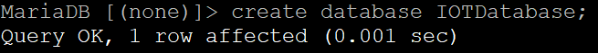

# **IOT2050 Setup**

- [**IOT2050 Setup**](#iot2050-setup)
  - [**Prepare the IOT2050**](#prepare-the-iot2050)
  - [**MySQL Server via MariaDB**](#mysql-server-via-mariadb)
  - [**Create Database, Datatable and User in MySQL**](#create-database-datatable-and-user-in-mysql)

## **Prepare the IOT2050**

Follow [SIMATIC_IOT2050_Setting_up.md](https://github.com/uwedaeumler/IOT2050-SmartFarming-Application/blob/main/docs/SIMATIC_IOT2050_setting_up.md) for the following steps:

- Installing the SD-Card Example Image (in this example the image V1.1.1 was used)
- First commissioning of the SIMATIC IOT2050: Remote access with Putty SSH Connection
- Working internet connection on the IOT2050

## **MySQL Server via MariaDB**

As already described in the Readme-File, the collected data is stored in a MySQL database. You can have the MySQL Server running on the IOT2050 or on any other machine. In this example MariaDB is used. The following steps describe how to install MariaDB using the apt package manager (a network connection is required):

|No.|Action|
|:-:|-|
|1.|Open a valid serial Putty connection and login as root|
|2.|Update the packages index by using the following command:|
||$ *sudo apt update*|
|3.|Install MariaDB after the package list is updated:|
||$ *sudo apt install mariadb-server*|
|4.|After the successful installation the MariaDB service will start automatically. You can verify it by using:|
||$ *sudo systemctl status mariadb*|
|||
||(You can end a command by the combination CTRL+ C)|

## **Create Database, Datatable and User in MySQL**

|No.|Action|
|:-:|-|
|1.|Open a valid serial Putty connection and login as root|
|2.|Use the command $ *sudo mysql -u root* to enter the MariaDB client shell|
|||
|3.|Create a new Database named 'IOTDatabase' with the command $ *create database IOTDatabase;*|
|||
|4.|Access a list of existing databases by typing the command $ *show databases;*|
|||
|5.|To create a new MariaDB user ('iotuser'), type the following command: $ *create user 'iotuser'@localhost identified by 'password';* (choose a secure password of your choice)|
|||
|6.|After you created 'iotuser', you can check its status by the command $ *select user from mysql.user;*|
|||
|7.|To grant all privileges to 'iotuser' use the command $ *grant all privileges on \*.\* to 'iotuser'@localhost identified by 'password';*. Use $ *flush privileges;* to refresh the privileges.|
|||
|8.|Verify 'iotuser' has the right permissions by using the following statement: $ *show grants for 'iotuser'@localhost;*|
|||
|9.|Select the IOTDatabase: $ *use IOTDatabase;*|
|||
|10.|Create a new table using the following command: $ *CREATE TABLE IOTDatatable (source TEXT, value_bool INT, value_real FLOAT, value_int FLOAT, value_time INT);*|
|||
||(You can exit the MariaDB client shell by the combination *CTRL+ C*)|

The next step is to set up the Node-Red flow: [README_NODERED_FLOW](README_NODERED_FLOW.md)
