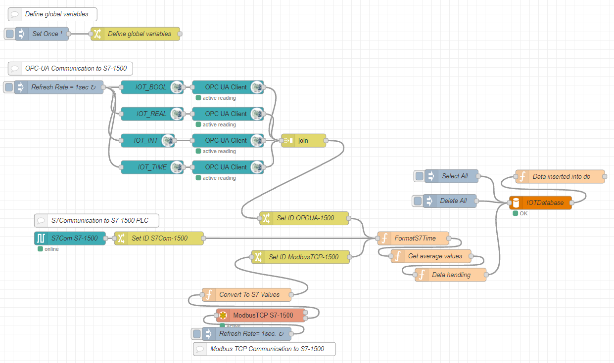
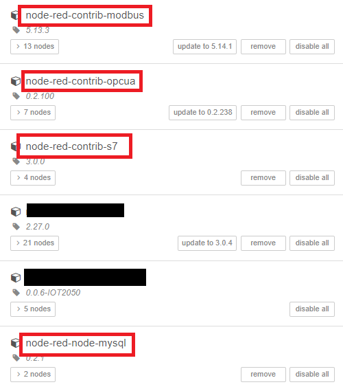
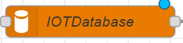
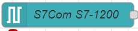
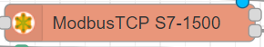
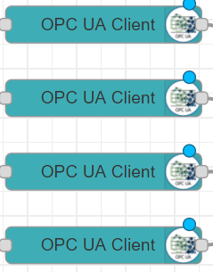
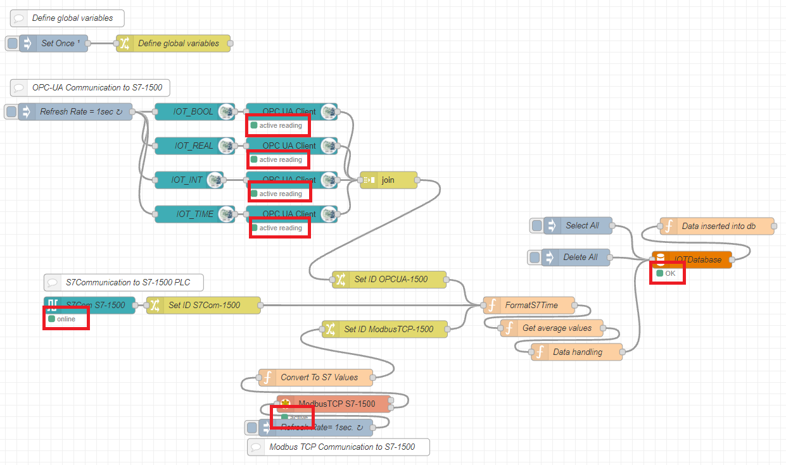
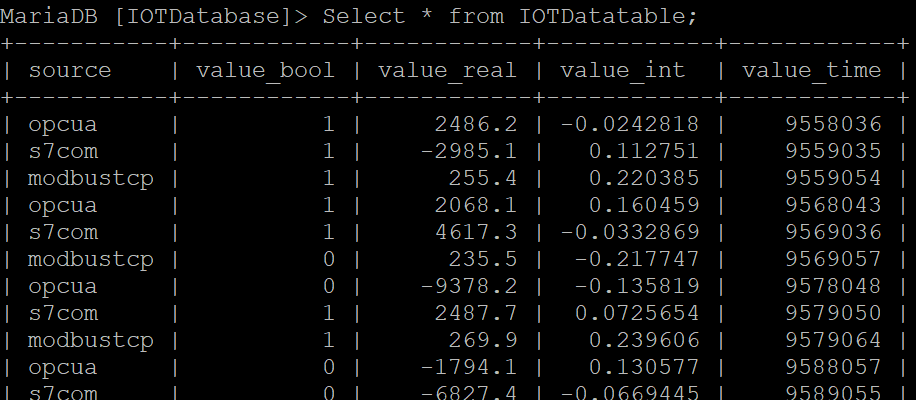

# **Node-Red Flow**

- [**Node-Red Flow**](#node-red-flow)
  - [**Overview**](#overview)
  - [**Node-Red**](#node-red)
  - [**Required packages**](#required-packages)
  - [**Import Node-Red Flow**](#import-node-red-flow)
  - [**Configuration of the Node-Red Flow**](#configuration-of-the-node-red-flow)
  - [**Success Control**](#success-control)

## **Overview**

The following figure shows the complete Node-RED flow needed to read data from three plc’s using S7 communication, Modbus TCP and OPC UA. The flow also contains the logic needed to buffer the data and store it in a database.

The values are read from three different PLC’s. Every data set is given a unique ID to identify the data source, be able to distinguish the values when the average is calaculated and when the data is stored in the database.

## **Node-Red**

On the Example Image version 1.1.1 (used in this manual) node-Red is already preinstalled and autostart is enabled. To access it, open a browser on your PC connected to the IOT2050 and open the URL `http://<IP of the IOT2050>:1880/`.

## **Required packages**

For the application some packages are required:

- node-red-contrib-s7 (V 3.0.0)
- node-red-contrib-modbus (V 5.13.3)
- node-red-contrib-opcua (V 0.2.100)
- node-red-node-mysql (V 0.2.1)

The package *node-red-node-mysql* is not yet preinstalled on the image version 1.1.1 and must be installed in Node-Red: Open a browser on your PC connected to the IOT2050 and open the URL `http://<IP of the IOT2050>:1880/`.

    Menu -> Manage palette -> Switch to the tab "Install" -> Search for "node-red-node-mysql" -> Click install

You should see the following packages in the "Manage Palette"-Menu:

## **Import Node-Red Flow**

Download the ready-made JSON-FIle: [IOTDataCollector_NodeRED_flow.json](../src/IOTDataCollector%20NodeRED%20flow.json)

Import the flow:

    Menu -> Import -> Select a file to import -> Press the Import-Button

## **Configuration of the Node-Red Flow**

You need to adjust the settings for the MySQL node:

|Node Type|Node|Command|
|-|-|-|
|mysql database|| Double-Click on the node -> Click on the pen-symbol next to "Database" -> Set the connection parameters (Host: IP-address of the IOT2050 or 'localhost' / Port: MariaDB default-port is 3306 / User & Password: User from the IOTDatabase)|

If you used other network settings for the PLC, these must be adjusted in the following nodes:

|Node Type|Node|Command|
|-|-|-|
|s7 in|| Double-Click on the node -> Click on the pen-symbol next to "PLC" -> Set the connection parameters (Nb. S7 1200/1500 uses Slot 1 and S7 300/400 uses Slot 2)|
|modbus getter|| Double-Click on the node -> Click on the pen-symbol next to "Server" -> Set the connection parameters (default port number is 503)|
|4x OpcUA client||Double-Click on the node -> Click on the pen-symbol next to "Endpoint" -> Set the connection parameters (make sure you do this for each of the four nodes)|

To implement changes press the deploy-button in the upper right corner.

## **Success Control**

If all configurations are set correctly, the flow will look like the following. All read-nodes are active and the database shows "OK":

Also, the contents of the database can be checked. To do this, go to the mariadb control ($ *sudo mysql -u root*) again, select the database ($ *use IOTDatabase;*) and use the following command: $ *SELECT \* from IOTDatatable*;

